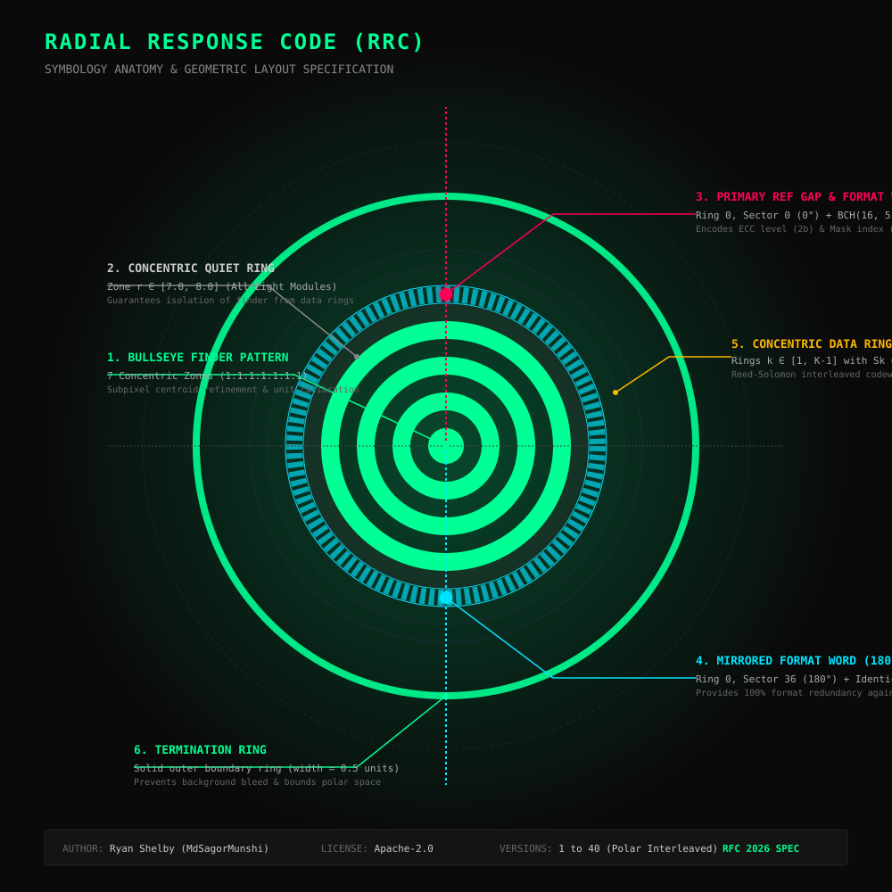

# 🌀 RRC — Radial Response Code

<p align="center">
  
</p>

<p align="center">
  <strong>A Next-Generation Polar 2D Optical Code Symbology &amp; Scanner System</strong><br>
  <em>Designed from first principles with concentric annular rings, 360° intrinsic rotation invariance, and zero dependencies on legacy matrix barcode formats.</em>
</p>

<p align="center">
  <a href="LICENSE"></a>
  <a href="SPEC.md"></a>
  <a href="https://github.com/MdSagorMunshi"></a>
</p>

---

## ⚡ Overview

**RRC (Radial Response Code)** breaks free from the 30-year-old Cartesian grid paradigm of legacy barcodes (QR Code, Data Matrix, Aztec). Instead of square pixels on a rectilinear grid that require searching for corner finder patterns and computing perspective homographies, RRC organizes data along **concentric annular wedges** around a central 7-zone bullseye finder.

### Key Symbology Properties
- **True 360° Rotation Invariance:** The central bullseye finder ($1:1:1:1:1:1:1$ ratio) is radially symmetric, enabling instant subpixel center discovery from any angle without testing matrix orientations.
- **Redundant Format Sectors:** Ring 0 houses dual mirrored $\text{BCH}(16, 5)$ format words at $0^\circ$ and $180^\circ$ that calibrate angular orientation and recover Error Correction Level and Mask Index even under severe localized damage.
- **Divisor-Snapped Polar Sectors:** Every concentric data ring has a sector count strictly selected from $\text{Divisors}(360) = \{24, 30, 36, 40, 45, 60, 72, 90, 120, 180, 360\}$, guaranteeing polar periodic alignment.
- **From-Scratch Reed-Solomon over $\text{GF}(2^8)$:** Pure implementation of Berlekamp-Massey error locator polynomial solving, Chien root search, and Forney error magnitude computation with zero external barcode crates.
- **Dynamic 8-Way Radial Masking:** Evaluates angular adjacency runs, radial concentric stripes, and symbol balance to select optimal visual diffusion.
- **Multi-Target Visual Aesthetics:** Native renderers for Vector SVG (curved annular `<path>`s), PNG (2x2 supersampling AA), JPEG, and terminal Unicode Braille (`U+2800..U+28FF`).

---

## 🏛 Architecture Comparison

| Feature | Legacy QR Code | Data Matrix | Aztec Code | **Radial Response Code (RRC)** |
| :--- | :---: | :---: | :---: | :---: |
| **Geometry** | Square Cartesian Grid | Square/Rect Grid | Square Rings | **Polar Concentric Annular Rings** |
| **Finder Geometry** | 3 Corner Squares | L-Shape Border | Square Bullseye | **Central 7-Zone Circular Bullseye** |
| **Rotation Calibration** | Multi-corner Homography | Corner Vertex Angle | Corner Layers | **Dual 0°/180° Ref Gaps in Ring 0** |
| **Sector Boundaries** | Square Modules | Square Modules | Square Pixels | **Annular Wedges (Divisors of 360°)** |
| **Damage Tolerance** | Single corner loss breaks orientation | Corner destruction breaks scan | Finder damage fatal | **Mirrored Format Words + Interleaved RS** |
| **Terminal Rendering** | Chunky half-blocks | Chunky blocks | Chunky blocks | **High-Density Unicode Braille Dots** |

---

## 📦 Workspace Monorepo Structure

```
RRC/
├── Cargo.toml                       # Workspace root configuration
├── LICENSE                          # Apache-2.0 License (Ryan Shelby)
├── README.md                        # Project documentation & quick start
├── SPEC.md                          # Formal RFC 2026-RRC Symbology Specification
├── spec/diagrams/symbol_layout.svg  # High-resolution symbology layout diagram
│
├── crates/
│   ├── rrc-core/                    # Pure Rust algorithmic engine
│   │   ├── src/
│   │   │   ├── geometry.rs          # Polar math, V1-V40 version lookup table
│   │   │   ├── ecc.rs               # GF(2^8) Reed-Solomon, Berlekamp-Massey, Forney
│   │   │   ├── bitstream.rs         # BCH(16,5) format word, 4 encoding modes
│   │   │   ├── mask.rs              # 8 radial masks, penalty scoring engine
│   │   │   ├── detect.rs            # 8-ray bullseye scanner, subpixel centroid refinement
│   │   │   ├── encoder.rs           # Complete polar symbol synthesis pipeline
│   │   │   ├── decoder.rs           # Candidate angle search & payload recovery
│   │   │   └── render/              # SVG, PNG (supersampled), JPEG, ASCII & Braille
│   │   └── tests/full_pipeline.rs   # Integration tests (rotation invariance, damage tolerance)
│   │
│   ├── rrc-cli/                     # Reference Command-Line Interface (`rrc`)
│   │   └── src/main.rs              # Clap CLI with owo-colors dark neon output
│   │
│   ├── rrc-cpp/                     # C ABI & Modern C++17 Header Wrapper
│   │   ├── include/rrc.h            # Single-header C/C++ API
│   │   ├── src/lib.rs               # extern "C" ABI exports
│   │   ├── CMakeLists.txt           # CMake build integration
│   │   └── examples/example.cpp     # C++ usage demonstration
│   │
│   ├── rrc-node/                    # Node.js bindings via napi-rs
│   │   ├── src/lib.rs               # High-performance NAPI bindings
│   │   ├── index.d.ts               # TypeScript typings
│   │   └── package.json             # NPM package specification
│   │
│   └── rrc-kotlin/                  # Kotlin / Android bindings via UniFFI
│       ├── src/rrc.udl              # UniFFI interface definition
│       ├── src/lib.rs               # UniFFI scaffolding implementation
│       └── build.gradle.kts         # Gradle Android/JVM build configuration
```

---

## 🚀 Quick Start

### 1. Command-Line Interface (CLI)

Install or run the CLI directly from the workspace:

```bash
# Build the binary
cargo build --release -p rrc-cli
```

#### Encode Data
```bash
# Generate high-resolution SVG with dark neon aesthetic
cargo run -p rrc-cli -- encode "https://github.com/MdSagorMunshi/rrc" \
  -o rrc_symbol.svg \
  --ecc H \
  --dark-color "#00FF94" \
  --light-color "#0A0A0A"

# Generate PNG raster image
cargo run -p rrc-cli -- encode "RADIAL RESPONSE CODE" -o code.png --scale 12

# Display directly in terminal using Unicode Braille
cargo run -p rrc-cli -- encode "https://github.com/MdSagorMunshi/rrc" --braille
```

#### Decode an Image
```bash
cargo run -p rrc-cli -- decode code.png
```

```
⚙ Scanning code.png (320x320 pixels)...

┏━━━━━━━━━━━━━━━━━━━━━━━━━━━━━━━━━━━━━━━━━━━━━━━━┓
┃  RADIAL RESPONSE CODE (RRC) — DECODE SUCCESS
┣━━━━━━━━━━━━━━━━━━━━━━━━━━━━━━━━━━━━━━━━━━━━━━━━┫
┃  Version:       2
┃  ECC Level:     M
┃  Encoding Mode: Byte
┃  Byte Length:   36 bytes
┣━━━━━━━━━━━━━━━━━━━━━━━━━━━━━━━━━━━━━━━━━━━━━━━━┫
┃  DECODED TEXT:
┃    https://github.com/MdSagorMunshi/rrc
┗━━━━━━━━━━━━━━━━━━━━━━━━━━━━━━━━━━━━━━━━━━━━━━━━┛
```

#### Inspect Version Specifications
```bash
# View specific version metrics (e.g. Version 1)
cargo run -p rrc-cli -- info 1

# Display full capacity table across all 40 versions
cargo run -p rrc-cli -- info
```

---

### 2. Rust API (`rrc-core`)

Add to `Cargo.toml`:
```toml
[dependencies]
rrc-core = { path = "crates/rrc-core" }
```

```rust
use rrc_core::{encode, decode, render_svg, render_png, EncodeOptions, DecodeOptions, EccLevel};

fn main() -> Result<(), Box<dyn std::error::Error>> {
    let payload = b"https://github.com/MdSagorMunshi/rrc";

    // 1. Encode with options
    let mut opts = EncodeOptions::default();
    opts.ecc_level = EccLevel::M;
    let symbol = encode(payload, &opts)?;

    // 2. Render to vector SVG or raster PNG
    let svg_string = render_svg(symbol.version, &symbol.matrix, &symbol.style);
    let png_bytes = render_png(symbol.version, &symbol.matrix, &symbol.style)?;

    // 3. Decode from RGBA buffer
    let (width, height, rgba) = rrc_core::render_to_rgba(symbol.version, &symbol.matrix, &symbol.style);
    let result = decode(&rgba, width, height, &DecodeOptions::default())?;

    println!("Decoded payload: {}", String::from_utf8_lossy(&result.payload));
    Ok(())
}
```

---

### 3. Node.js / TypeScript (`@rrc/node`)

```typescript
import { encodeSvg, encodePng, decodeRgba, getVersionInfo } from '@rrc/node';

// Query version capacity
const v1 = getVersionInfo(1);
console.log(`V1 rings: ${v1.ringCount}, capacity: ${v1.capacityBytesM} bytes`);

// Generate SVG string
const svg = encodeSvg("https://github.com/MdSagorMunshi/rrc", {
  ecc: 'H',
  style: 'rounded',
  darkColor: '#00FF94',
  lightColor: '#0A0A0A'
});

// Generate PNG Buffer
const pngBuffer = encodePng("https://github.com/MdSagorMunshi/rrc");

// Decode from raw RGBA buffer
const decoded = decodeRgba(rawRgbaBuffer, 512, 512);
console.log(`Decoded: ${decoded.text}, Version: ${decoded.version}`);
```

---

### 4. C++ API (`rrc-cpp`)

Include the unified header [`include/rrc.h`](crates/rrc-cpp/include/rrc.h):

```cpp
#include "rrc.h"
#include <iostream>

int main() {
    try {
        std::string url = "https://github.com/MdSagorMunshi/rrc";

        // Generate vector SVG
        std::string svg = rrc::encode_svg(url, rrc::EccLevel::M);
        std::cout << "Generated SVG: " << svg.length() << " chars\n";

        // Generate PNG binary buffer
        std::vector<uint8_t> png = rrc::encode_png(std::vector<uint8_t>(url.begin(), url.end()));
        std::cout << "Generated PNG: " << png.size() << " bytes\n";

        // Decode from RGBA buffer
        auto result = rrc::decode(rgba_ptr, width, height);
        std::cout << "Decoded: " << result.text() << " (V" << (int)result.version << ")\n";
    } catch (const rrc::Error& e) {
        std::cerr << "Error [" << e.code << "]: " << e.what() << "\n";
    }
}
```

---

### 5. Kotlin / Android (`rrc-kotlin`)

```kotlin
import com.github.mdsagormunshi.rrc.*

// Encode to SVG vector
val svg = encodeSvg("https://github.com/MdSagorMunshi/rrc".toByteArray(), "M", null)

// Encode to PNG bytes
val pngBytes = encodePng("https://github.com/MdSagorMunshi/rrc".toByteArray(), "H", 2.toUByte())

// Decode from camera frame RGBA bytes
val result = decodeRgba(rgbaBytes, width, height, null)
println("Decoded text: ${result.text}, Mode: ${result.mode}")
```

---

## 🧪 Testing & Verification

The test suite covers the entire pipeline across 28+ unit and integration tests:

```bash
# Run all unit tests across all crates
cargo test --workspace

# Run full optical scanner pipeline integration tests:
# - 360-degree rotation invariance across arbitrary angles
# - Roundtrip encoding & decoding across all 4 modes (Numeric, Alphanumeric, Byte, Extended)
# - Roundtrip verification across multiple symbol versions
# - Sector visual style validity (Sharp, Rounded, Pill, InnerRounded)
# - Error correction tolerance under physical damage simulation
cargo test -p rrc-core --test full_pipeline
```

---

## 📜 License & Attribution

- **Symbology & Implementation:** Developed and authored by **Ryan Shelby** (GitHub: [`MdSagorMunshi`](https://github.com/MdSagorMunshi)).
- **License:** Licensed under the **Apache License, Version 2.0**. See the [LICENSE](LICENSE) file for complete details.
